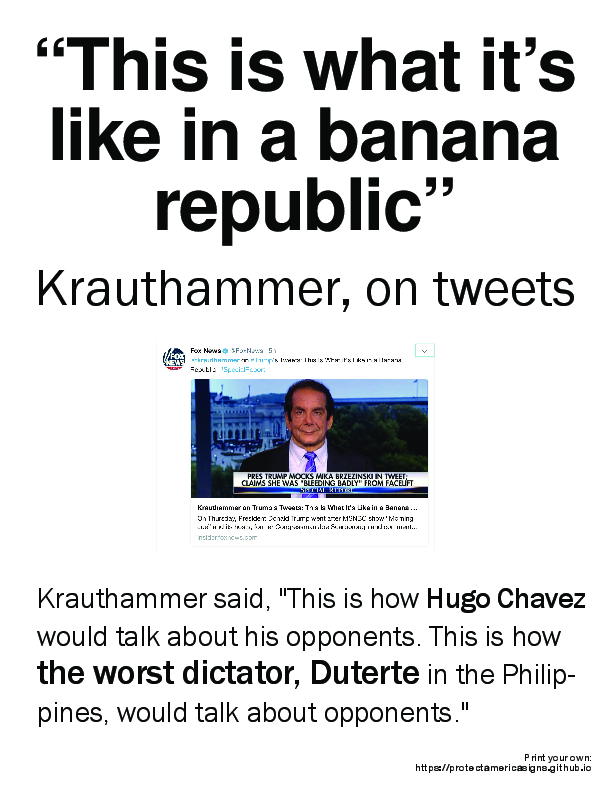
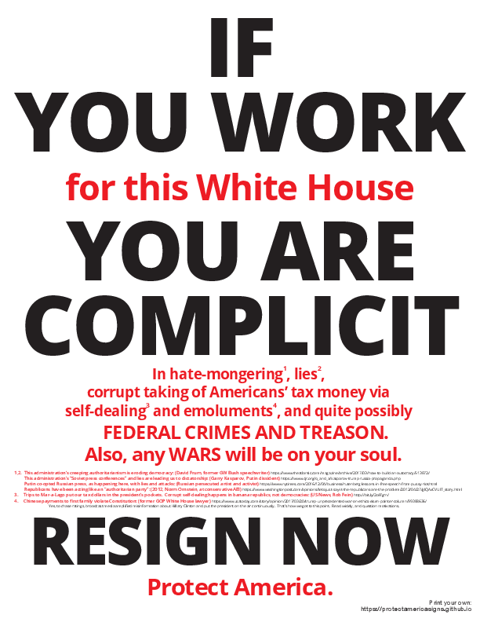

# Signs to publicize the degradation of US democracy

This sign prints on a standard sheet of paper.    

You can buy full-page US letter size labels, print the PDF on the labels with a standard laser or inkjet printer, and hang them up yourself. 

&nbsp; | &nbsp;
------------------ | ---
 |  "This is what it's like in a banana republic" -- Charles Krauthammer, GOP intellectual, referring to the president's use of twitter.
 |  **If you work for this White House**    **You are complicit**   In hate-mongering(1), lies(2), corrupt taking of Americans’ tax money   via self-dealing(3) and emoluments(4), and quite possibly federal crimes and   treason.  Also, any wars will be on your soul.   [full references, elaborating on these points](#complicit-poster-text)

 
 
 
 

# Post pictures

Take pictures of the signs. #protectamericasigns #protectamerica

## Contact

[Email us](protectamericaposters@tutanota.com).

 
 

---

## Complicit poster text

**If you work for this White House**

**You are complicit**

In hate-mongering(1), lies(2), corrupt taking of Americans’ tax money via self-dealing(3) and emoluments(4), and quite possibly federal crimes and treason.  Also, any wars will be on your soul.

* (1,2.) &nbsp;
  * This administration’s creeping authoritarianism is eroding democracy [(David Frum, former GW Bush speechwriter)](https://www.theatlantic.com/magazine/archive/2017/03/how-to-build-an-autocracy/513872/)
  * This administration’s “Soviet press conferences” and lies are leading us to dictatorship: [(Garry Kasparov, Putin dissident)](https://www.cjr.org/q_and_a/kasparov-trump-russia-propaganda.php)
  * Putin co-opted Russian press, as happening here, with lies and attacks: [(Russian persecuted artist and activist)](https://www.nytimes.com/2016/12/04/business/rutenberg-lessons-in-free-speech-from-pussy-riot.html)
  *  Republicans have been acting like an “authoritarian party”: [(2012, Norm Ornstein, at conservative group AEI)](https://www.washingtonpost.com/opinions/lets-just-say-it-the-republicans-are-the-problem/2012/04/27/gIQAxCVUlT_story.html)
* (3.) Trips to Mar-a-Lago put our tax dollars in the president’s pockets.  Corrupt self-dealing happens in banana republics, not democracies: [(US News, Rob Fein)](http://bit.ly/2oFfgrn/)
* (4.) Chinese payments to first family violate Constitution: [former GOP White House lawyer.](https://www.usatoday.com/story/opinion/2017/03/20/trump-unprecedented-war-on-ethics-eisen-painter-column/99388636/)

Yes, to chase ratings, broadcast media amplified misinformation about Hillary Clinton and put the president on the air continuously.  That’s how we got to this point.  Read widely, and question motivations. 

---

 
 

---

 
